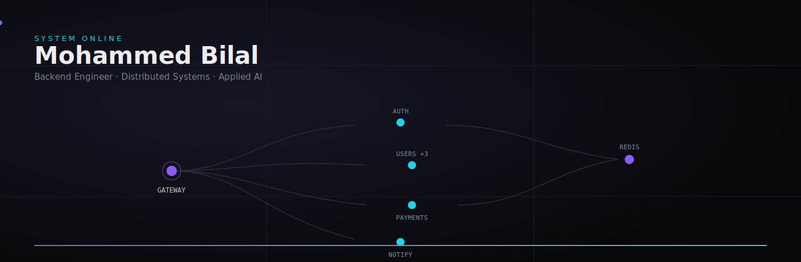
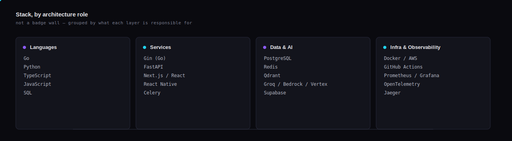
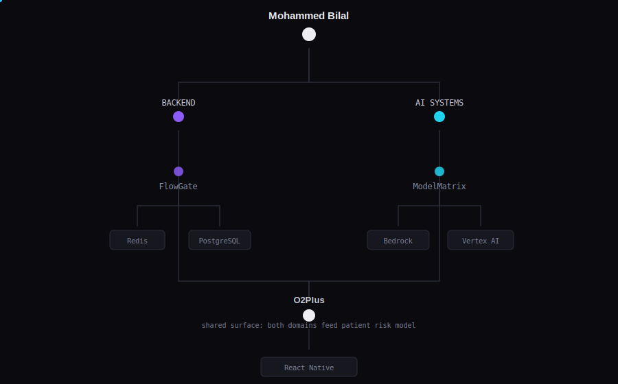
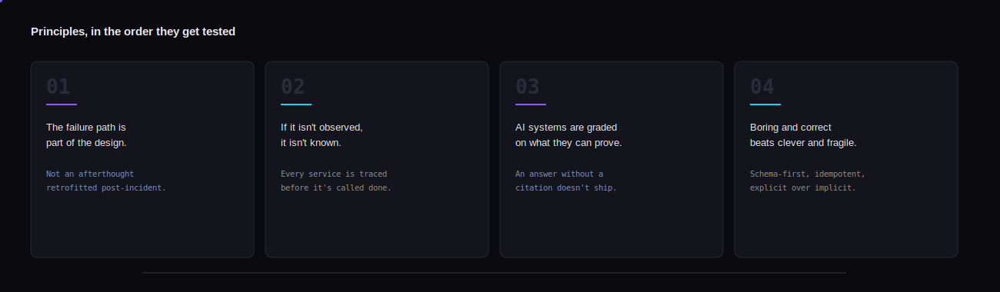
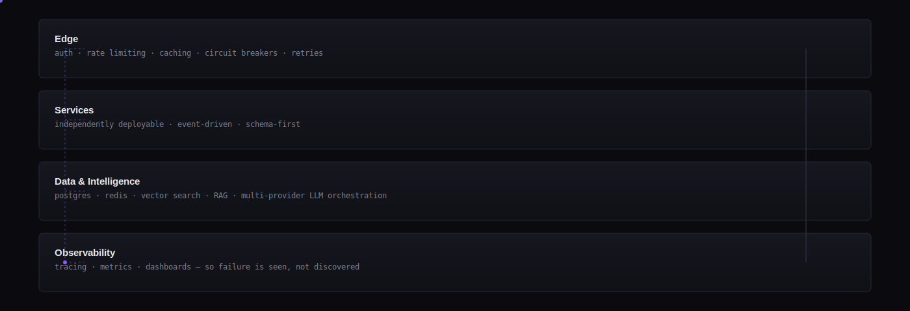
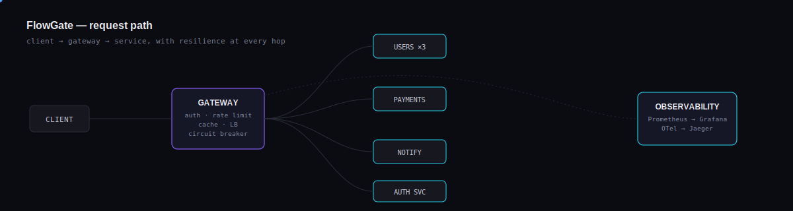
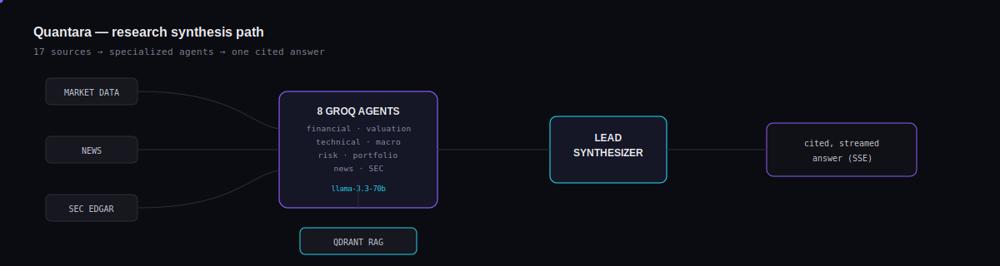
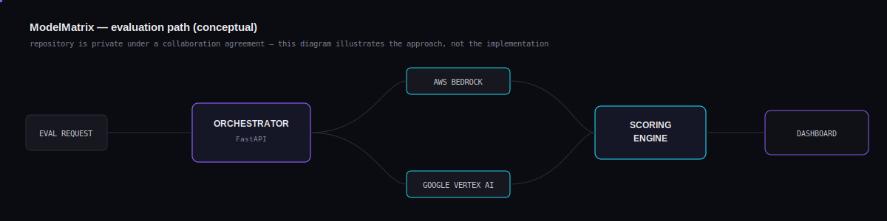
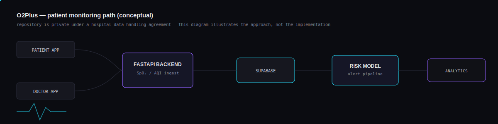

 

<table width="100%">
<tr>
<td width="70%" valign="top">

I build the layer that sits underneath products — the part that's supposed to be
invisible, because it never breaks. Gateways that hold up under real traffic.
Retrieval pipelines that answer from evidence, not confidence. Observability that
tells you what happened before a customer has to.

Two systems below are public. Two were built under agreements with partners I don't
get to name-drop details for — a hospital and an enterprise cloud team — so they're
described, not exposed.

</td>
<td width="30%" valign="top" align="right">

**[Portfolio →](https://www.mohammedbilal.me)**
**[GitHub →](https://github.com/bilalinbytes)**
**[LinkedIn →](https://linkedin.com/in/mohammed-bilal-23678328a)**

</td>
</tr>
</table>

<!-- 
## How the systems connect

Backend and AI systems aren't separate tracks — they converge. O2Plus is the clearest
example: a React Native app backed by the same schema-first, observable-by-default
backend discipline as FlowGate, feeding a risk model that draws on the same
multi-provider LLM orchestration patterns as Quantara.

 -->

## How I think about a system

Four rules I don't break, in order of how often they get tested:

**1. The failure path is part of the design, not an afterthought.**
A circuit breaker retrofitted after an incident is a patch. Designed in from the
gateway layer, it's an architecture decision — that's the difference between
FlowGate's resilience and a service that just happens to work most days.

**2. If you can't observe it, you don't actually know it works.**
Every service I ship gets traced before it gets "done." Not because dashboards look
good in a demo, but because the alternative is finding out from a user.

**3. AI systems are graded on what they can prove, not what they generate.**
Quantara's agents cite sources because an unsupported answer is a liability wearing
a helpful tone. Retrieval that can't show its work doesn't ship.

**4. Boring and correct beats clever and fragile.**
Schema-first, idempotent by default, explicit over implicit. The interesting
engineering problems are hard enough without adding self-inflicted ones.

<!-- ## Architecture — the shape most of my systems take

Edge absorbs traffic shape before it reaches anything stateful. Services stay
independently deployable so one failure domain can't take down another. Data and
inference sit together because retrieval and generation are the same problem now.
Observability threads through every layer instead of bolting onto the last one.

 -->

## Projects

### FlowGate — distributed API gateway

| | |
|---|---|
| **Problem** | Resilience patterns — retries, rate limits, breakers — usually get scattered across services after something breaks. There's no single place they're enforced. |
| **Decision** | Put them at the edge, in front of the services, as first-class parts of the request path rather than per-service afterthoughts. |
| **Challenge** | Circuit breakers need per-instance *and* per-service state without becoming a shared bottleneck — solved with health-aware routing that isolates failing instances without penalizing their siblings. |
| **Status** | Auth (JWT + API key, RBAC), rate limiting, caching, load balancing, circuit breakers, service discovery, and full tracing are live — 6 Grafana dashboards, OpenTelemetry → Jaeger. Queues and Kubernetes deployment are next. |

`Go` `Gin` `Redis` `PostgreSQL` `Prometheus` `Grafana` `OpenTelemetry` `Jaeger`

**[→ Repository](https://github.com/bilalinbytes/flowgate)**

 

### Quantara — AI financial intelligence platform

| | |
|---|---|
| **Problem** | SEC filings, market data, and news arrive unstructured and disconnected. Turning them into one defensible answer normally takes an analyst hours. |
| **Decision** | 8 specialized agents (financial, news, SEC, valuation, technical, macro, risk, portfolio) research in parallel, a lead agent synthesizes, and every claim traces back to a cited source via Qdrant-indexed filings. |
| **Challenge** | Prompt-injection surface area grows with every external data source. Guardrails run at ingestion, not just at the model boundary — an untrusted filing shouldn't be able to redirect the agent that's reading it. |
| **Status** | Live: cited SSE chat, Celery-driven watchlist monitoring with daily briefings, JWT + OAuth. Next: cross-document reasoning, persistent agent memory across sessions. |

`Next.js 16` `FastAPI` `Groq (llama-3.3-70b)` `Qdrant` `PostgreSQL` `Redis` `Celery`

**[→ Repository](https://github.com/bilalinbytes/quantara)** · **[→ Demo](https://drive.google.com/file/d/1lpx3ViCeQ7w0_v1oteKPrzjUci1-gib8/view)**

 
<!-- 
### ModelMatrix &amp; O2Plus — private

Built under partnership agreements, so I can't publish the repos or real screenshots
— but I can walk through the architecture, the decisions, and the results directly.

ModelMatrix evaluates LLMs from AWS Bedrock and Google Vertex against consistent,
auditable criteria for an enterprise customer of CoreStack. -->

O2Plus is a respiratory monitoring platform built with AIIMS Delhi — live SpO₂ and
air-quality tracking feeding a real risk model, not a generic vitals dashboard.

