# 👋 Hey there! I'm Mohammed Bilal

<div align="center">
  
</div>

<div align="center">
  
</div>

---

<div align="center">

**🎓 B.Tech CSE @ PES University, Bangalore** | **📍 Based in India** | **💼 2+ Years Experience**

[](https://bilalm.vercel.app)
[](https://linkedin.com/in/mohammed-bilal-dev)
[](mailto:mohammedbilal96654@gmail.com)
[](https://github.com/bilalinbytes)
[](https://hackerrank.com/profile/bilalinbytes)

</div>

---

## 🚀 About Me

```python
class Developer:
    def __init__(self):
        self.name = "Mohammed Bilal"
        self.role = "Full-Stack Developer & AI/ML Engineer"
        self.education = "B.Tech CSE @ PES University (2023-2027)"
        self.experience = "2+ years building production systems"
        self.leadership = "Head of Web Development @ Mahil AI Club"
        
        self.current_focus = [
            "🔥 AI-powered web applications",
            "⚡ Scalable microservices architecture", 
            "🤖 LLM integration & optimization",
            "🏗️ Cloud-native system design"
        ]
        
        self.philosophy = "Building the future, one commit at a time"
        
    def get_specialties(self):
        return {
            "frontend": ["React.js", "Next.js", "TypeScript", "Tailwind CSS"],
            "backend": ["Node.js", "FastAPI", "Express.js", "RESTful APIs"],
            "ai_ml": ["PyTorch", "LangChain", "Transformers", "NLP"],
            "cloud_devops": ["Docker", "CI/CD", "MongoDB", "PostgreSQL"],
            "leadership": ["Team Management", "Mentoring", "Technical Workshops"]
        }

me = Developer()
print("👨‍💻 Ready to build something amazing together!")
```

---

## 🛠️ Tech Stack & Tools

<div align="center">

### 💻 Languages & Frameworks


### 🤖 AI/ML & Data Science


### 🗄️ Databases & DevOps


</div>

---

## 🏗️ Featured Projects

<div align="center">
<table>
<tr>
<td width="50%">

### 🤖 TeamBanalo
**AI-Powered Team Formation Platform**

🔧 **Tech**: React.js, FastAPI, Docker, LangChain  
✨ **Impact**: 80% reduction in manual overhead  
🚀 **Scale**: 1000+ concurrent sessions  

- NLP-based resume parsing & semantic scoring
- Custom LLM logic for optimized team matching  
- Dockerized backend with Supabase integration
- 30% improvement in matching speed

[](https://github.com/bilalinbytes)

</td>
<td width="50%">

### 📄 CV Sensei  
**ATS Resume Optimization Tool**

🔧 **Tech**: Python, Streamlit, BERT, NLP  
✨ **Impact**: 95%+ accuracy in predictions  
👥 **Users**: 200+ beta testers  

- BERT-based keyword alignment system
- Grammar feedback & resume scoring engine
- PyMuPDF integration for data extraction  
- Actionable improvement recommendations

[](https://github.com/bilalinbytes)

</td>
</tr>
<tr>
<td width="50%">

### 💻 CodeMentor AI
**Real-Time Code Review Platform**

🔧 **Tech**: React.js, Node.js, Gemini API  
✨ **Features**: 15+ language support  
🔒 **Security**: JWT & role-based access

- Real-time collaboration & AI suggestions
- Syntax highlighting & version control
- Multi-user sessions with live updates
- Used by coding clubs for training

[](https://github.com/bilalinbytes)

</td>
<td width="50%">

### 🔒 Sécurité Système
**Smart Security E-commerce Platform**

🔧 **Tech**: MERN Stack, MongoDB Atlas  
⚡ **Performance**: <200ms response time  
🚀 **Deployment**: CI/CD with GitHub Actions

- Smart home security product marketplace
- Payment gateway integration
- Admin dashboard with analytics
- Scalable cloud deployment

[](https://github.com/bilalinbytes)

</td>
</tr>
</table>
</div>

---

## 🏆 Leadership & Achievements

<div align="center">

</div>

### 👨‍💼 Head of Web Development - Mahil AI Club, PES University
**Jan 2024 - Present**

- 🎯 Led 50+ developers in workshops and live sessions
- 🛠️ Built internal tools: event registration system & eQuestion API  
- 🏁 Organized CTF competitions with coding puzzles
- 🤝 Mentored 5+ junior developers on Git, CI/CD, and API development
- 🔥 Integrated real-time AI/ML demos using Firebase

### 🏅 Notable Achievements

- 🥇 **Top 10 Finalist** - Delta Time Hackathon (24-hour 3D game development)
- 🎯 **KCET Top 4%** - Merit-based PES University admission  
- 📜 **Certified** - ML with Python, React.js, C++, Software Development

---

## 📊 GitHub Analytics

<div align="center">
  
  
</div>

<div align="center">
  
</div>

<div align="center">
  
</div>

---

## 🎯 What I'm Currently Working On

```mermaid
graph LR
    A[🤖 AI Applications] --> B[LangChain Integration]
    A --> C[Custom ML Models]
    
    D[⚡ System Architecture] --> E[Microservices Design] 
    D --> F[Cloud Optimization]
    
    G[🚀 Open Source] --> H[Community Projects]
    G --> I[Developer Tools]
    
    J[📚 Learning] --> K[System Design]
    J --> L[Advanced AI/ML]
```

<div align="center">



</div>

- 🔥 Building production-ready AI applications with LangChain
- ⚡ Architecting scalable microservices for high-traffic systems  
- 🤖 Experimenting with transformer models for specialized NLP tasks
- 🏗️ Contributing to open-source projects in the ML/AI space
- 📖 Deepening knowledge in distributed systems and system design

---

## 💡 Technical Philosophy

<div align="center">


</div>

> *"The best code is not just functional—it's readable, maintainable, and solves real problems."*

**Core Principles:**
- 🎯 **User-First Design** - Every feature should solve a genuine user problem
- ⚡ **Performance Matters** - Optimize for speed without sacrificing code quality  
- 🔄 **Continuous Learning** - Technology evolves, and so should we
- 🤝 **Collaborative Growth** - Great products are built by great teams
- 🛡️ **Security by Design** - Build secure systems from the ground up

---

## 📫 Let's Connect & Collaborate!

<div align="center">

I'm always excited to discuss new opportunities, innovative projects, or simply chat about the latest in tech! 

**Looking for:**
- 🚀 Full-stack development opportunities  
- 🤖 AI/ML projects and research collaborations
- 👥 Open-source contributions and community building
- 💡 Hackathons and competitive programming

**Open to:**
- 💼 Internship and full-time opportunities
- 🎓 Research projects and academic collaborations  
- 🗣️ Speaking at tech events and conferences
- 🤝 Mentoring junior developers

[](https://bilalm.vercel.app)
[](mailto:mohammedbilal96654@gmail.com)
[](https://linkedin.com/in/mohammed-bilal-dev)
[](tel:+919370778994)

</div>

---

<div align="center">

### 🌟 Fun Facts About Me

*I debug with console.log() and I'm proud of it! 🐛*  
*My commits are either "fix bug" or "major refactor" - no in-between 😄*  
*I can turn coffee into code, but I'm still working on the reverse process ☕*

---


**⭐ If you find my work interesting, consider giving my repositories a star!**

</div>

<div align="center">
  
</div>
